# Creating an client-server application with GitHub Copilot, .NET and Visual Studio

These instructions are designed for community leaders and presenters who wish to pick up this session, and present it at community events. Below, you'll find all the necessary assets and relevant instructions for each stage of the presentation.

## Session Details

**Session Title:** Build a .NET client-server application with Visual Studio and GitHub Copilot

**Session Abstract:** Client-server applications are a modern way to develop and deploy code to the internet, and run the client in multiple platforms such as web browsers, mobile phones, etc. With .NET, you have a very versatile way to develop both the server-side code (for example with ASP.NET Minimal APIs) and the client-side application (for example with Blazor). But even if you are not familiar with .NET, our powerful tools Visual Studio and GitHub Copilot will assist you. In this lab, you will learn how to create a new client-server application in .NET from scratch, with the help of GitHub Copilot. You will run and test the application fully locally with the Azurite storage emulator (included in Visual Studio). Finally, you will learn how to deploy to Azure using an automated CI/CD pipeline with GitHub actions.

**Level:** 100-200

**Goal of the session:** Create a client-server application with .NET, Blazor, Minimal API in Visual Studio and with GitHub Copilot. Run the application locally, then deploy it to Azure.

**Duration:** 45 Minutes for the local part. Fast learners can do the deployment part too, or use an extended session.

**Speaker Expectation/Skills:** Basic programming skills, attention to details, basic understanding of how APIs work and how client-server applications are structured.

### Material

You can use the [attached slide deck](#slides) to introduce the lab.

To understand how to run this lab, [refer to the description below](#lab).

There are also recorded videos showing the whole process [at the end of this document](#videos).

### Prerequisite

To run this lab, you need to have [Visual Studio](https://visualstudio.microsoft.com/) Version 17.11.3 installed. We will also use the [Azure Storage Explorer](https://azure.microsoft.com/products/storage/storage-explorer/).

#### For deployment

If you want to deploy to Azure, we will also need the following:

- A GitHub account. You can use a private GitHub account for this.
- An Azure subscription. You can get a [free Azure subscription here](https://azure.microsoft.com/pricing/purchase-options/azure-account/) to test this out.

## Before we start

Large Language Models (LLMs) are non-deterministic (aka stochastic). Asking the same question twice may or may not result in a different answer. As such, it is quite difficult to write a lab that is going to work in the exact same manner 100% of the time.

To make things easier, we provide [code snippets for each step](./client-server-app-vs-copilot-dotnet/snippets), to show what GitHub Copilot *should* suggest. It is possible that the actual result you get is different from what we get.

In case of doubt, we also provided the various steps of the projects in the [steps folder](./client-server-app-vs-copilot-dotnet/steps). You can always use these steps as a starting point at any moment of the lab.

## Pay attention to the vocabulary

In this lab, we are using two ways of communicating with GitHub Copilot.

### The GitHub Copilot Chat window

This is a window (that can be docked) where you can have a dialog with GitHub Copilot. To open this window, press `Ctrl-Q` to open the feature search. Then type `GitHub Copilot chat`. You can now open this window.

Whenever the instructions ask you to type a prompt in the *GitHub Copilot Chat* window, this is where you should do it.

### The `alt-/` inline window

Sometimes the instructions will ask you to type `Alt-/` to open an inline window. To do this, press the `Alt` key and the `/` key together.

> In the rest of this document, we will call this key combination `Alt-/'.

This inline window is useful when you want to include some code directly inside a code file.

## Lab

### Creating the front-end

#### Creating the project

1. Open Visual Studio.
2. Select `Create a new project`.
3. Search for the template named `Blazor WebAssembly Standalone App` and press `Next`.

> NOTE: If you cannot find this template, look at the [Blazor docs](https://dotnet.microsoft.com/learn/aspnet/blazor-tutorial/install).

4. In the `Configure your new project` window, change the name to `CarCatalog`.
5. Select a location for the new project, then press `Next`.
6. In the `Additional information` window, unselect the checkbox `Include sample pages`.
7. Make sure that the framework is set to `.NET 8.0 (Long Term Support)`.

> If you don't see .NET 8.0 as an option, make sure that your version of Visual Studio is up to date.

8. Make sure that the options are set as described on the picture below, then press `Create`.


9. Wait until the project is fully open, then run the application by pressing Ctrl-F5.

At this point, your web browser will open, and you will see the following page.


> You can find the first step completed [in this folder](./client-server-app-vs-copilot-dotnet/steps/Step1/).

#### Creating the first draft in Razor

1. Open the Solution Explorer.
2. Open Pages / Home.razor
3. Place the cursor below the line reading `Welcome to your new app`.
4. Press `Alt` and `/` together.

> In the rest of this document, we will call this key combination `Alt-/'.

5. Enter the following prompt in the "Ask Copilot" popup.

```txt
Create a collection called Cars. This collection is a list of Car instances. Each car has a Make, Model and Year. The collection is initialized by a call to the GetCars method which returns 3 instances. The default value for the Cars collection is an empty collection. This code should be placed in a @code block.
```

6. Review the code. If it seems alright to you, press Accept.

> You can see the code that [Copilot should create here](./client-server-app-vs-copilot-dotnet/snippets/snippet1.cs).
 
7. Place the cursor below the line reading `Welcome to your new app` again.
8. Press `Alt-/` and enter the following prompt:

```txt
Create a table of cars taking its source in the Cars collection.
```

9. Review the code. If it seems alright to you, press Accept.

> You can see the code that [Copilot should create here](./client-server-app-vs-copilot-dotnet/snippets/snippet2.razor).

10. Run the application again. You should see a list of 3 cars, with Make, Model and Year but without styling.

> You can find the second step completed [in this folder](./client-server-app-vs-copilot-dotnet/steps/Step2/).


#### Refactoring in code-behind

1. Select the whole code within the `@code` block.
2. Open the GitHub Copilot Chat window and type the following prompt.


```txt
Move the selected code in a code-behind file
```

3. Review the proposal in the Copilot chat window. You can accept the C# code by pressing `Insert in new file`.
4. Save the new file. Make sure that the name is `Home.razor.cs` and save it in the `Pages` folder, right next to the `Home.razor` file.
5. In the `Home.razor` page, delete the whole `@code` block.
6. Press `Ctrl-F5` to run the application and make sure it works as expected.

> Saving with the name `Home.razor.cs` shows the new file under the `Home.razor` in the Solution Explorer file as shown below.


##### If compilation fails

If the code cannot be compiled, follow the steps:

1. In `Home.razor.cs`, place your cursor on the first word following the `namespace` keyword.
2. Then press `Ctrl-.` and select `Change namespace to match folder structure` from the context menu.

> You can find this step completed [in this folder](./client-server-app-vs-copilot-dotnet/steps/Step3/).

#### Styling the page

1. Place your cursor at the end of the razor page and press `Alt-/`.
2. Enter the following prompt.

```txt
Add some styling for the table
```

3. Review the code proposed. This should look like [the snippet here](./client-server-app-vs-copilot-dotnet/snippets/snippet3.razor).
4. Run the application again by pressing `Ctrl-F5`. You should now see the list of 3 cars, with make, model and year, with a nicer appearance.

> You can find this step completed [in this folder](./client-server-app-vs-copilot-dotnet/steps/Step4/).

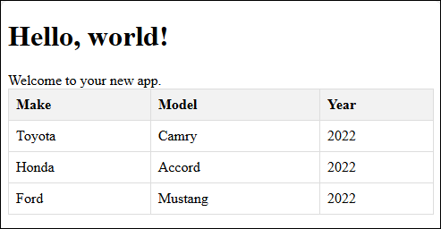

### Creating the backend

1. In Visual Studio, in the Solution Explorer, right-click on the CarCatalog solution and select `Add / New Project...`.

> The Solution is the top item in the Solution Explorer.

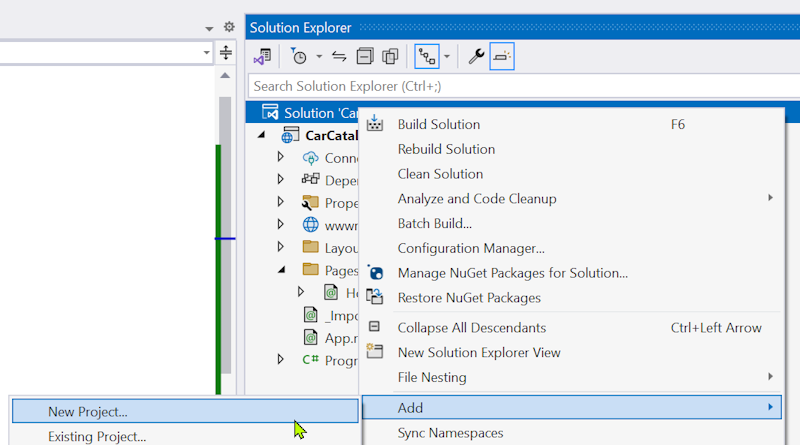

2. Search for the template named `ASP.NET Core Web API` and click on `Next`.
3. Change the project name to `CarService` and select a location. You can either place this project in the upper CarCatalog folder, or in another location altogether.
4. In the `Additional information` windows, make sure to configure as follows:
    1. Framework: `.NET 8.0 (Long Term Support)`.
    1. Check `Enable OpenAPI Support`
    1. Uncheck `Use controllers`.
5. Click on `Create`.

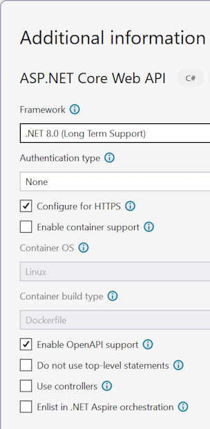

6. In the Solution Explorer, open `Program.cs`. Make sure to select the `Program.cs` file under the `CarService` project and not the one under `CarCatalog`!
7. Delete everything between `app.UseHttpsRedirection();` and `app.Run();`. Also delete the `WeatherForecast` record. After the deletion, [your code should look like this](./client-server-app-vs-copilot-dotnet/snippets/snippet4.cs).
8. Place your cursor just *before* the line reading `app.Run();`.
9. Type `Alt-/` and enter the prompt.

```txt
Create a minimal API GET method returning a list of 3 cars in JSON format. Each car should have a Make, Model and Year properties. The method should return the list of cars without converting it to JSON.
```

10. Review the code and if it looks OK, you can `Accept` it. After the change, [your code should look like this](./client-server-app-vs-copilot-dotnet/snippets/snippet5.cs).

> NOTE: Sometimes GitHub Copilot proposes code that is too complex. Make sure that your `MapGet` call looks like this:

```csharp
app.MapGet("/api/cars", () =>
{
    var cars = new List<Car>
    {
        new Car { Make = "Toyota", Model = "Camry", Year = 2022 },
        new Car { Make = "Honda", Model = "Accord", Year = 2021 },
        new Car { Make = "Ford", Model = "Mustang", Year = 2020 }
    };

    return cars;
});
```

#### Testing the API

1. Right-click on the `CarService` project and then select `Debug / Start Without Debugging`.

Because we enabled OpenAPI support, you will see a Swagger page in your web browser looking like this:

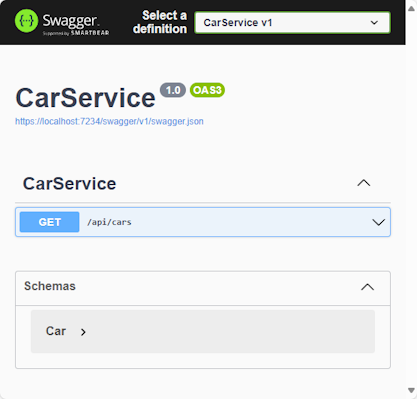

To test the API, you can follow these steps:

2. Expand the `GET /api/cars` method.
3. Click on `Try it out`.
4. You should be able to see the JSON code in the response body.


5. Copy on the URL displayed in the `Request URL` field. It should be looking like `https://localhost:7071/api/cars`.


> It's very possible that your URL's port number is different. That's OK.

**Make sure to keep the web application running!**

> You can find this step completed [in this folder](./client-server-app-vs-copilot-dotnet/steps/Step5/).

### Connecting the front-end to the backend

1. In the `Home.razor.cs` file, select the content of the `GetCars` method and delete it.
2. Place the cursor inside the `GetCars` method and press `Alt-/`. Then enter the following prompt.

```txt
Connect to the web application to get the list of cars in JSON formats. Make sure to ignore the casing of the properties.
```

3. Notice how GitHub Copilot is doing the right thing and proposing to make the corresponding code asynchronous. If you are satisfied with the code, click on `Accept`.
4. Add a `using` reference to the `JsonSerializer` class. To do this, place the cursor on the `JsonSerializer` where the "red squiggly lines" are shown and press `Ctrl-.`. This opens Intellisense.
5. Select `using System.Text.Json` from the pop-up menu.


6. Replace the URL that is used by the HttpClient with the URL you copied earlier in the Swagger window.
7. Right-click on the `CarCatalog` project and select `Debug / Start Without Debugging`.

### Fixing the error

At this point you should see an error in the web browser window. To understand errors in the web application, the easiest way is to use the browser tools.


1. In the web browser, press `F12` to display these tools.
2. Select the Console tool. It is probably showing a message mentioning the CORS policy.

CORS (Cross-Origin Resource Sharing) is a protection mechanism where a server-side application (in our case the Web API application) can specify which client-side applications are allowed to access it. To keep things simple here, we will instruct the server-side application to accept requests from any client-side application.

3. Go back to the Solution Explorer in Visual Studio.
4. Switch to the GitHub Copilot Chat window and enter the following prompt.

```txt
Set up CORS in the web API application so my Blazor app can call it. I want any application to be able to call the web API.
```

Copilot will propose some code changes to the Program.cs file. What we really want is the instruction that starts with `builder.Services.AddCors` as well as the line that reads `app.UseCors("AllowAll");`. Modify your code to add these instructions. After the change, [your code should look like this](./client-server-app-vs-copilot-dotnet/snippets/snippet6.cs).

> You can ignore the other instructions from Copilot. Our project is already configured correctly, all we need is really just these two additions to the Program.cs file.

5. Right click on the CarService project and select `Debug / Start Without Debugging`.
6. In the Solution Explorer, right-click on the `CarCatalog` project and select `Debug / Start Without Debugging`.

At this point, the client application should be able to get the list of cars from the Web API application.

> You can find this step completed [in this folder](./client-server-app-vs-copilot-dotnet/steps/Step6/).

### Getting the data from the Azure Tables service

It's not very interesting to get data from a hard-coded code file. In most cases, the data will be stored in a database. In the next step, we will show you how to connect to the [Azure Table storage service](https://learn.microsoft.com/azure/storage/tables/table-storage-overview). This is a very simple, cheap but efficient storage system, that you can experiment with. Later, you can of course decide to migrate your data to a more robust and powerful service, such as [Azure Cosmos DB](https://learn.microsoft.com/azure/cosmos-db/).

1. Right-click on the `CarService` project in the Solution Explorer, and select `Set as Startup project`
2. In the `CarService` project, open the Program.cs file.
3. Delete the call to the `app.MapGet` method.
4. Open the GitHub Copilot chat window and type the following prompt:

```txt
Create a minimal API GET method to connect to Azure.Data.Tables to get the list of Cars. Keep things as simple as possible without using CosmosDB. Also provide instructions to add the corresponding packages using the Package Manager Console.
```

GitHub Copilot is going to propose multiple steps to you. Let's review.

> As always, these steps might look different on your machine, since GitHub Copilot can propose different solutions to the same prompt. You can either follow GitHub Copilot's instructions precisely, or follow the instructions here.

#### Installing the Nuget packages

GitHub Copilot proposes one or more ways to install the Nuget packages necessary to connect to an Azure Data table. For instance:

```txt
Open the NuGet Package Manager in Visual Studio and install the following packages:
•	Azure.Data.Tables
•	Microsoft.AspNetCore.OpenApi
Alternatively, you can use the Package Manager Console:

Install-Package Azure.Data.Tables
Install-Package Microsoft.AspNetCore.OpenApi
```

1. Copy the first line `Install-Package Azure.Data.Tables`.
2. Press `Ctrl-Q` to open the Visual Studio Feature search.
3. Search for `package manager console`.
4. In the Package Manager Console, make sure that the `Default project` dropdown is set to `CarService`.
5. In the Package Manager Console, paste the line you copied and press `Enter`.
6. Now copy the line `Install-Package Microsoft.AspNetCore.OpenApi` and run this line in the Package Manager Console.

#### Creating the Car entity

It's possible that GitHub Copilot proposes to save the `Car` entity class in a separate file, or in the Program.cs file directly. Here we will save the `Car` entity class in a new file by pressing `Insert in new file` and then saving the `Car.cs` file in the `CarService` project folder.

> Entity classes are classes implementing the `ITableEntity` interface. They facilitate the communication with the Azure Data table.

You can see how the `Car` entity class looks like [in this snippet](./client-server-app-vs-copilot-dotnet/snippets/snippet7.cs).

#### Creating the minimal API call

GitHub Copilot is proposing code for the Program.cs file. You can review the code and if it looks good to you, make the necessary changes. After the modification, your code [should look like this](./client-server-app-vs-copilot-dotnet/snippets/snippet8.cs).

> Make sure to delete the `Car` class from Program.cs, as this would cause a conflict with the `Car` entity class we just created.

##### Security concern!!!

[In the snippet](./client-server-app-vs-copilot-dotnet/snippets/snippet8.cs), you will see that GitHub Copilot is proposing to store the connection string directly in the Program.cs file. This is a **big security concern** because it means you would probably save this in GitHub or in another source control repository. Repeat after me: **You should NEVER save connection strings or other secrets in source control**.

This shows that GitHub Copilot just like other LLMs can propose code that is not safe, or that doesn't compile. It's up to you, the developer, to make sure that the proposed code is correct and safe.

We will change this in the next step, after we configure the Azurite storage emulator.

### Connecting to Azurite

In order to test this change locally, we will use the Azure Storage emulator called Azurite.

> [Azurite](https://learn.microsoft.com/azure/storage/common/storage-use-azurite) is an open-source emulator allowing you to run Azure Storage Blob, Table and Queue services directly on your local machine. It is really convenient to test everything with test data, without having to deploy or connect to Azure.

**Azurite is installed with Visual Studio**, so you don't need to install it separately. However you will need to configure your project with the following steps:

1. Press `Ctrl-Q` to open the Feature Search. Then look for `Connected Services`.
2. In the search box, select `Azure Storage`, `Project > Connected Services > Add > Azure Storage`.
3. In the `Connect to dependency` window, select `Storage Azurite emulator (Local)`.
4. For the `Connection string name` field, enter `AzureTableStorage`.
5. Make sure that `Do not save value anywhere` is selected for the connection string value location and press `Next`.
6. Uncheck the `Code`, `NuGet packages` and `Secrets store` checkboxes. We don't need this here.
7. Press `Finish` and the `Close`.

#### Creating the Azure Table

At this point, you need to put some data in the Azure Table so you can test the code locally. To do this, the easiest way is to use the Azure Storage Explorer. [This tool can be installed from this URL](https://azure.microsoft.com/products/storage/storage-explorer/).

After you install Azure Storage Explorer, run the tool and follow the steps.

1. Run the Web Api application by right-clicking on the `CarService` project in Visual Studio, and selecting `Debug / Start Without Debugging`.
2. In the Azure Storage Explorer panel, expand `Emulator & Attached` > `Storage Accounts` > `(Emulator - Default Ports) (Key)` > `Tables`.


3. Right click on the Tables and select `Create Table`.


4. Enter the name of the table `Cars`.
5. Click on the `Cars` table to open it.
6. Click on the `Add` button.

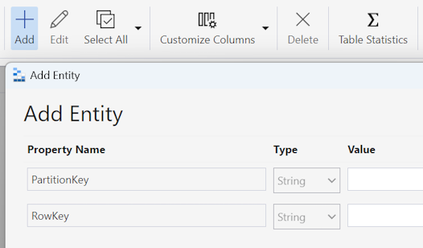

7. In the `Add Entity` window, set `PartitionKey` to `Test Make 1`.
8. Set RowKey to `Test Model 1`.
9. Click on `Add Property` and set the `Property Name` to `Make`, and the Value to `Test Make 1`.
10. Click on `Add Property` and set the `Property Name` to `Model`, and the Value to `Test Model 1`.
11. Click on `Add Property` and set the `Property Name` to `Year`, the Type to `Int32`, and the Value to `1999`.

> Technically, we need a unique PartitionKey / RowKey combination for each vehicle. We could use different values depending on how we want to optimize the data. [More information about PartitionKey and RowKey can be found here](https://learn.microsoft.com/rest/api/storageservices/designing-a-scalable-partitioning-strategy-for-azure-table-storage).

You can repeat the steps 6 to 11 multiple times with different values to add test data to your table.

#### Setting the connection string

As we saw earlier, GitHub Copilot proposed to set the connecting string directly in the Program.cs code. This is however a bad practice. **You never want to save secrets in source control!!**

In order to change this, let's ask Copilot how we should do things properly.

1. Go back to Visual Studio and open the GitHub Copilot Chat window.
2. Enter the following prompt:

```txt
Where can I add the connection string for my Azure Table Storage account?
```

3. Following Copilot's suggestion, open the appsettings.json file and add the connection string. After your change, [it should look like this](./client-server-app-vs-copilot-dotnet/snippets/snippet9.json).
4. Set the `AzureTableStorage` connection string to `UseDevelopmentStorage=true`.

> The `UseDevelopmentStorage=true` connection string is specifically used to connect to the local emulator. When we deploy our application to Azure, we will configure a different connection string in the settings, connecting our application to the actual storage account.

5. In Program.cs, replace this line:

```csharp
string connectionString = "YourAzureStorageConnectionString";
```

with:

```csharp
var connectionString = builder.Configuration.GetConnectionString("AzureTableStorage");
```

Now we have a clean configuration, where the connection string and the code are kept neatly separated.

#### Testing

You can now test your application.

1. First, right-click on the `CarService` project and select `Debug / Start Without Debugging`.
2. In the Swagger window in your web browser, click on `Try it out` then `Execute`.

The Response body should show the entities you entered in the Azure Storage Explorer, in JSON format.

3. Then, right-click on the `CarCatalog` project, and select `Debug / Start Without Debugging`.

If everything was configured properly, you should see the list of entities in the Blazor application.

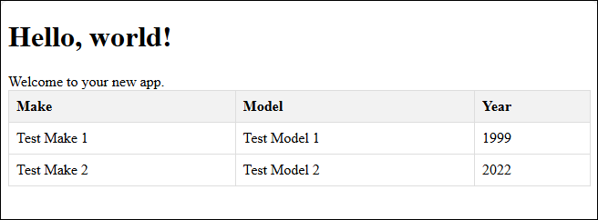

> [You can see the final project in this folder](./client-server-app-vs-copilot-dotnet/steps/Final/).

## Deployment (Optional)

> This part of the workshop is optional, and can be done if you still have time.

In order to run this on Azure, we are going to deploy using GitHub Actions.

> GitHub actions are enabling what is often called CI/CD (Continuous integration / Continuous deployment). It means that every time you make a change to your project, this will automatically be deployed to Azure. This is great for peace of mind!

### Putting the code in GitHub

First, we will create a GitHub repository for the code, and commit/push the code to it. We can do all this from Visual Studio directly.

1. In Visual Studio, with the `CarCatalog` solution open, you should see both projects (`CarCatalog` front-end and `CarService` backend) in the Solution Explorer.
2. Press `Ctrl-Q` to open the feature search, and type `Git changes`. Open that window.

At this point, your code is not saved in a repository yet.

> It is always recommended to save your code in source control, because it makes it much easier to avoid accidents, lose code, to revert to a previous version, etc. Note that you can use source control locally too, without saving your code to GitHub or anther source control provider.

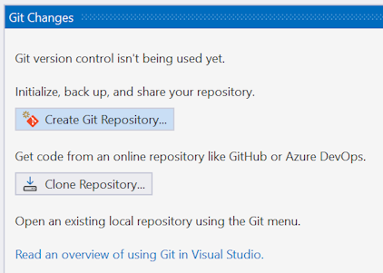

3. Click on `Create Git Repository` button.
4. On the side, under `Push to a new remote`, select `GitHub`.

> If you don't see GitHub in the list, make sure that you are logged into GitHub from Visual Studio, [using these instructions](https://learn.microsoft.com/visualstudio/ide/work-with-github-accounts?view=vs-2022).

5. Set the fields as follows:
    1. Local path: Leave as is.
    2. .gitignore template: `Default (Visual Studio)`. The .gitignore file is used to define which files must be saved in GitHub and which files must be ignored.
    3. License template: You can leave this empty.
    4. Account and Owner: Make sure your GitHub account is selected.
    5. Repository name: This must be a unique name within your GitHub account. Most probably you want to keep the default `CarCatalog`.
    6. Description: You can enter a description here.
    7. Private repository: At this point, you can leave this checked.

When you are done entering the details, press `Create and Push`. After a short wait, the code is committed (saved locally), then pushed (saved to GitHub).

On top of the Git Changes window, you should see a notification. You can click on `Git Repository window` to open that window. Alternatively, you can use the feature search (`Ctrl-Q`) to open that window. This will show your source code with all the history.

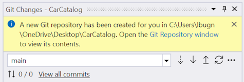

To see the code in GitHub, you can expand the `remotes/origin` folder on the right. Then right-click on the `main` branch in this folder, and select `Open in browser`.

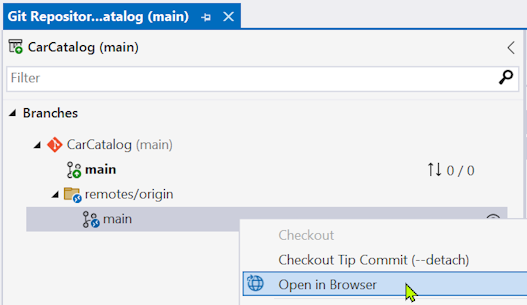

### Creating the Web App

The API (`CarService`) will be hosted in a Web App.

> You could also create the API in a serverless Azure Function. This is out of the scope of this lab, but something you may want to investigate. Azure Functions are usually cheaper than Web Apps on Azure, but they are less powerful and responsive.

1. Open the [Azure Portal](https://portal.azure.com/).
2. Make sure that you are logged in. If you don't have a subscription yet, [you can create a new one for free here](https://azure.microsoft.com/pricing/purchase-options/azure-account/).
3. Click on `Create a resource`.
4. In the `Create a resource` window, enter `Web App` in the search box.
5. Select `Web App` from the results.

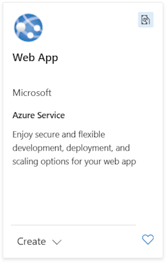

6. Press on `Create`.

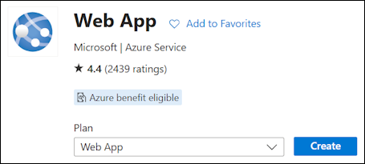

7. In the `Create Web App` window, enter the following details:
    1. Project Details
        1. Subscription: Make sure this is set to the subscription you want to use.
        2. Resource group: Press `Create new` and enter `CarCatalog`.
    2. Instance Details
        1. Name: Enter `carcatalog`. If the name is taken already, add a suffix, for example `carcatalog1234`.
        2. Publish: `Code`
        3. Runtime stack: `.NET 8 (LTS)`. LTS stands for Long Term Support.
        4. Operating system: `Windows`.
        5. Region: `East US 2`.
        6. Windows Plan: Press `Create new` and enter a name, for example `carcatalogplan`.
        7. Pricing plan: Enter `Free F1`.
8. Click on `Next: Database >`.
9. Click on `Next: Deployment >`.
10. In the `Deployment tab`, enter the details as follows:
    1. Continuous deployment: `Enable`.
    2. GitHub account: Make sure this is the same GitHub account as the one you used in Visual Studio earlier.
    3. Organization: Make sure that you are using the same GitHub organization (if any) as the one you used in Visual Studio earlier.
    4. Repository: Select the `CarCatalog` repository.
    5. Branch: Select `main`.
    6. Authentication settings: Make sure to set `Basic authentication` to `Enable`.
11. Press `Review and create`.
12. After a short moment, your inputs are going to be validated. Press `Create` to start the creation of the resources.

A few notes about all this:

- We could choose to publish to a container instead. There are certain advantages in using a container instead of "bare metal code", but this is out of the scope of this lab.
- .NET applications can also run on Linux. However the creation of the GitHub action is more manual if you decide to use Linux here.
- You can choose a different region, for example closer to your users to reduce latency.
- The Free (F1) app service plan is convenient to test your code and try new things. However it is limited to 60 minutes per day. If you want to use a more powerful plan, you can select it from the list.

The Azure portal is going to do a few things now.

- It's going to create the resources (Web App and App Service Plan).
- It's going to create a GitHub action for the deployment.
- It's going to save the GitHub action directly into the GitHub repository.
- It's going to create the *secrets* in GitHub that are needed for the action to work.

All this is going to take a couple of minutes, so you can sit down and relax.

### Creating the Storage account

Remember that the `Cars` table that we created in Azurite is used only for local development on your local machine. We will now create a Storage account and a Table in Azure to store the "production data".

1. In the Azure portal, go back to `Home`.
2. Click on `Create a resource`.
3. In the search box, enter `Storage account`.

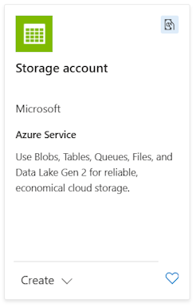

4. Select the Storage account from the result.
5. Press `Create`.
6. Enter the following details:
    1. Subscription: Same as before.
    2. Resource group: Make sure to select the resource group `CarCatalog` that you created in the previous step.
    3. Storage account name: Enter `carcatalogstore`.
    4. Region: Enter the same region as before.
    5. Primary service: Select `Other (tables and queues)`.
    6. Performance: Select `Standard`.
    7. Redundancy: Select `Locally-redundant storage (LRS)`.

> You could also select other options, these are certainly the cheapest and most efficient ones for our scenario. You can always get more information about these options through the information button next to each field name.

7. Press `Review + create`.
8. After the validation is complete, press `Create`.

### Creating the data

After a few moments, the resource is created. We will now create the table and a few entities.

1. Click on `Go to resource`.
2. On the left hand side, click on `Storage browser`.


3. Click on `Tables`.

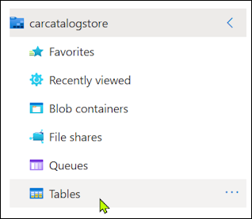

4. Click on `Add table`.
5. Enter the table name `Cars` then press `OK`.
6. Click on the `Cars` table.


7. Click on `Add entity`.
8. Enter the following details:
    1. `PartitionKey` : `Online Test Make 1`.
    2. Set RowKey to `Online Test Model 1`.
    3. Click on `Add Property` and set the `Property Name` to `Make`, and the Value to `Online Test Make 1`.
    4. Click on `Add Property` and set the `Property Name` to `Model`, and the Value to `Online Test Model 1`.
    5. Click on `Add Property` and set the `Property Name` to `Year`, the Type to `Int32`, and the Value to `1999`.
9. Repeat the steps above a few times to create more entities.

### Configuring the web API

Now we will configure the connection string for the Web App. If you remember, we set the local connection string in the `appsettings.json` file earlier, and we used `UseDevelopmentStorage=true` to instruct our application to use the Azurite storage emulator. Now we will overwrite this value to use the production database instead.

> To be even more secure, you can also store the connection string in a separate Azure KeyVault service, and retrieve it from there, [as described here](https://learn.microsoft.com/azure/app-service/app-service-key-vault-references?tabs=azure-cli).

1. On the left hand side, expand `Security + networking` and then `Access keys`.

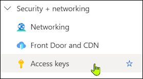

2. Under `key1`, `Connection string`, press `Show`.
3. Press on the small `Copy` icon at the right of the Connection string field.

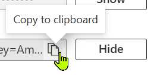

4. Click on `Home` again.
5. Click on the web app `carcatalog` (App service).
6. On the left hand side, expand `Settings` and then select `Environment variables`.

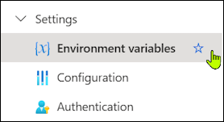

7. Press the `Connection strings` tab.

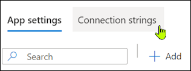

8. Click on `Add`.
9. Enter the `Name`: `AzureTableStorage`.
10. For `Value`, enter the connection string you just copied.
11. For `Type`, select `Custom`.
12. Click on the `Apply` button.
13. Then click on the `Apply` button at the bottom of the page, and `Confirm`.

### Testing the API

Now we can test if everything works well.

1. On the left hand side, select `Overview`.
2. Copy the link shown next to `Default domain`. It probably looks like `carcatalog.azurewebsites.net`.
3. Open another browser window and paste the domain name. Then add `api/cars` at the end, and press enter. The full URL should look like `carcatalog.azurewebsites.net/api/cars`.

If you see a JSON array with the entities you just created, SUCCESS, your backend works perfectly. Save the URL of the backend service, we will need it in a few.

## Deploying the front-end

For the front-end, we are going to deploy to a Static Web App. You could of course choose to deploy to the web server that you just created, but since our two services are neatly decoupled, this illustrates how easily you can compose services on Azure to create an application. Later, you could also imagine to create a mobile application with .NET MAUI to deploy to the Android or iPhone ecosystems.

### Deploying the front-end

1. Go back to the [Azure portal](https://portal.azure.com/).
2. Press on `Create a resource`.
3. Enter `Static web app` in the search box.
4. Select the Static Web App service from the results and click it.

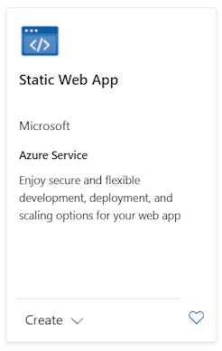

5. Click on `Create`.
6. Enter the following details:
    1. Subscription: Same as before.
    2. Resource group: Make sure to select the resource group `CarCatalog` that you created in the previous step.
    3. Name: Enter `carcatalog`.
    4. Plan type: Select `Free`.
    5. Deployment details:
        1. Source: `GitHub`.
        2. GitHub account: Make sure to select the same account as in Visual Studio before.
        3. Organization: Make sure to select the same organization as before.
        4. Repository: Select the `CarCatalog` repository.
        5. Branch: Select` main`.
        6. Build presets: Select `Blazor`.
        7. App location: Enter `./CarCatalog'.
        8. Api location: Leave this field empty.
        9. Output location: `wwwroot`.
    10. Press `Review and create`.
    11. After the validation completes, press `Create`.

The deployment should be pretty fast. Here too, the Azure portal saved the GitHub action in the repository, and configured the deployment secret.

When the deployment is complete, press on `Go to resources`.

In the `Essentials` area, you can see the URL of the front-end application.


Click on the link to open the Static Web App. It's probable that it's still empty at this point, since the GitHub action is not finished running.

### Understanding the GitHub action

The GitHub action that was created by the Azure portal will run automatically when code changes are pushed to the `main` branch. You can see the action running with these steps:

1. Go to the GitHub repository where you saved the code. We explained how to open this repository from Visual Studio at the end of the step titled [Putting the code in GitHub](#putting-the-code-in-github) here above.
2. Click on the Actions tab.


Now you can see some workflows run. The first one was the one deploying the code to the Web App. The last one is the one that just ran to deploy the Static Web app. Once the small checkmark next to the action is green, you can refresh the Blazor app to see the change.

### Fixing the error

We're not completely done yet. The application is not working, and an error notification is shown at the bottom of the page.


Press on F12 to open the developer tools in the web browser. You should see an error similar to the one displayed here in the Console.


This should remind you that we hard-coded the URL of the backend service in the Home.razor.cs page. Let's fix this now.

1. Go back to Visual Studio.
2. Open `Home.razor.cs`.
3. Find the line looking like

```csharp
var response = await httpClient.GetAsync("https://localhost:7071/api/cars");
```

4. Replace the URL in the GetAsync method with the one of your backend service that you copied earlier.
5. Go to the `Git Changes` window in Visual Studio.
6. Enter a message in the field, and then press `Commit All`.


7. Press on the `Push` button.


> If you see a `Git - Push failed` popup, simply press on `Pull then Push`. It means that the changes from GitHub will be downloaded locally first, and then your local changes will be pushed.

Go back to the GitHub repository's Actions tab and see that the action triggered automatically. Your change is being deployed to the Static Web App. Once the deployment is complete with a green checkmark, go back to the Blazor application and refresh the page. You should now see the cars being displayed.


## Conclusion

Thanks to the CI/CD pipelines we created, all your changes to the CarService or to the CarCatalog applications will automatically be deployed to Azure. This is your time to be creative and to add new features!

We hope that with this lab, you were able to see the power of Visual Studio, .NET, GitHub Copilot and Azure combined.

> Did you know that Blazor applications also run on mobile phones? Try to open the URL of the Blazor app on your mobile, and you will see the result displayed!

## Cleanup

Remember that even though we selected the free tier of Azure services, some minor cost will be incurred, for example by the Storage account. To avoid this, you can delete the resource group from your Azure subscription.

1. Go back to the [Azure portal](https://portal.azure.com/).
2. Go to the `CarCatalog` resource group.
3. Press the `Delete resource group` button.


4. Enter the resource group name in the field titled `Enter resource group name to confirm deletion` and press `Delete`.

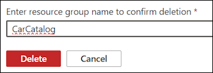

## Slides

You can use the slide deck below to introduce the lab and give a small part of theory.

[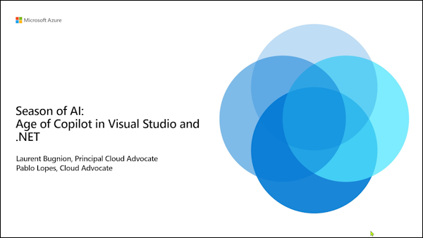](./client-server-app-vs-copilot-dotnet/SeasonOfAI_GHCopilot_NET.pptx)

## Videos

This section contains videos showing the whole process. You can use the videos to learn how to run the lab, or to illustrate the demo during a session.

### Part 1: Building the Front-End

Part 1 shows how to build the front-end locally with the help of Visual Studio and GitHub Copilot.

[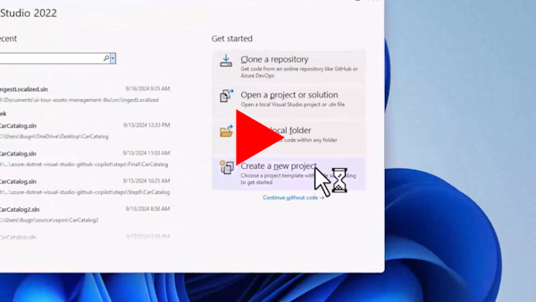](https://www.youtube.com/watch?v=6LqVUv0rVgE&list=PLl8yjZLsL_WqC-PWSyFEpa-Uxxs00q0iz)

### Part 2: Building the Backend

Part 2 shows how to build the backend with .NET Minimal APIs, with the help of Visual Studio and GitHub Copilot.

[](https://www.youtube.com/watch?v=3WZsdlGwe44&list=PLl8yjZLsL_WqC-PWSyFEpa-Uxxs00q0iz&index=2)

### Part 3: Connecting the front-end

Part 3 shows how to connect the front-end to the backend with the help of Visual Studio and GitHub Copilot. It also shows how to use GitHub Copilot to get help on configuring CORS.

[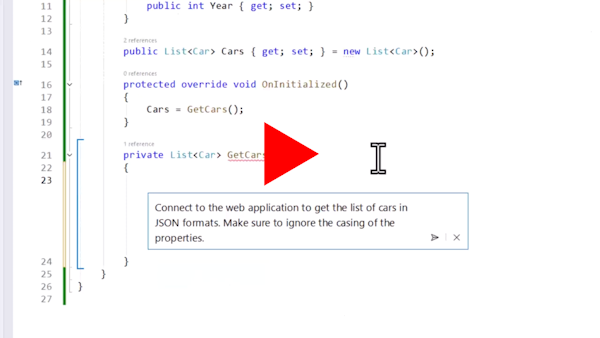](https://www.youtube.com/watch?v=sTPYywG65nI&list=PLl8yjZLsL_WqC-PWSyFEpa-Uxxs00q0iz&index=3)

### Part 4: Using local Azure Tables

Part 4 shows how we use Azure Tables locally for the data storage, and connect the backend to it with the help of Visual Studio and GitHub Copilot. It also shows how to use the storage emulator Azurite to run the application locally.

[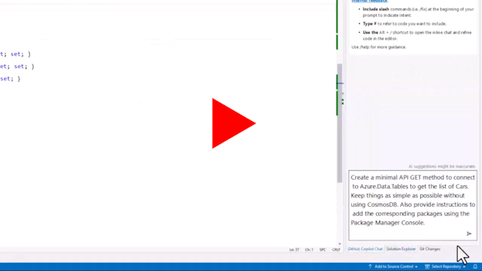](https://www.youtube.com/watch?v=XRNxfEszD_8&list=PLl8yjZLsL_WqC-PWSyFEpa-Uxxs00q0iz&index=4)

### Part 5: Deploying the Backend

Part 5 shows how to create a new Web App on Azure and use a GitHub action to deploy our Backend to it.

[](https://www.youtube.com/watch?v=LkIBjf6dzxE&list=PLl8yjZLsL_WqC-PWSyFEpa-Uxxs00q0iz&index=5)

### Part 6: Deploying the Front-end

Part 6 shows how to create a Static Web App on Azure, and deploy our front-end to it with a GitHub action.

[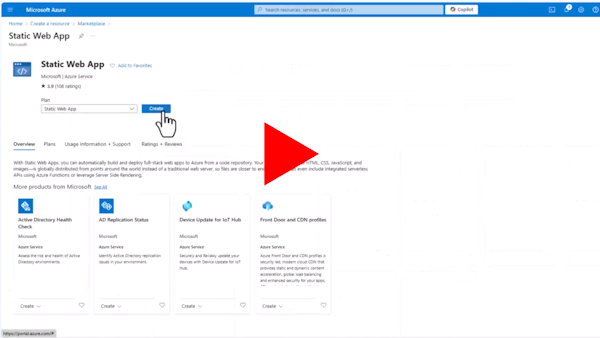](https://www.youtube.com/watch?v=a-UFB5K-mbw&list=PLl8yjZLsL_WqC-PWSyFEpa-Uxxs00q0iz&index=6)
